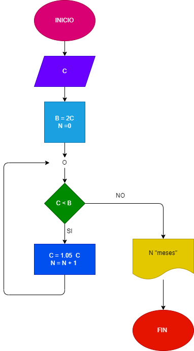

# EJERCICION No. 27

## Hacer el diagrama de flujo y el programa en python, que lea un capital c y que averiguar e imprima en cuantos meses se duplica, si lo colocamos a un imteres compuesto del 5% mensual 

